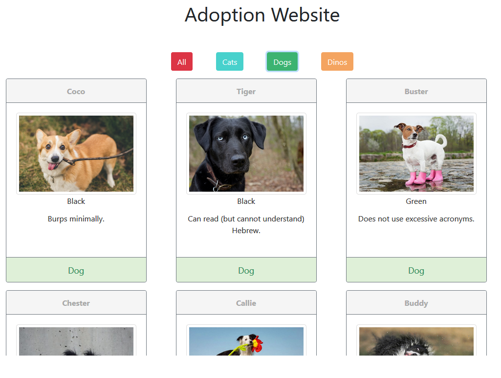

# Adoption Website

A fake pet adoption website where you can choose to adopt a cat, a dog, or a dinosaur. The purpose of this assignment was to get us used to modular javascript, and introduces us to JSON, and making XMLHttpRequests to bring in data from JSON.

## Screenshots




## How to run this project
* Use npm to install http-server in your terminal:
```sh
npm install -g http-server
```
* Run the server in your terminal
```sh
hs -p 9999
```
* Open chrome and navigate to:
```
localhost: 9999
```
* Click the pet buttons at the top of the page to filter out the unwanted pet types.
* Click the all button to show all pets.
